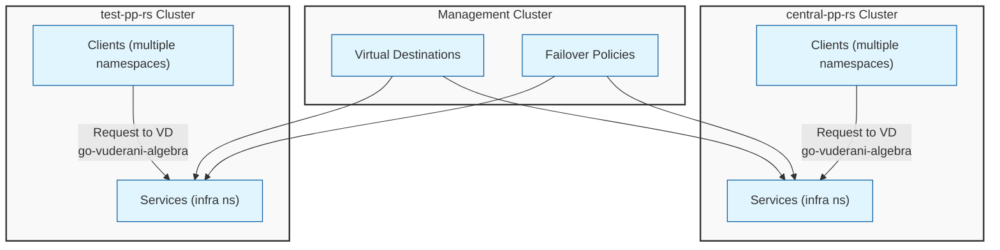

# Multi-Cluster Architecture with Virtual Destinations

This diagram illustrates the high-level architecture of the multi-cluster setup with Virtual Destinations and FailoverPolicies.

The diagram shows:
- A management cluster that hosts the Virtual Destinations and FailoverPolicies
- Two workload clusters: central-pp-rs and test-pp-rs
- Services and clients in each cluster
- How Virtual Destinations and FailoverPolicies are applied to services across clusters 