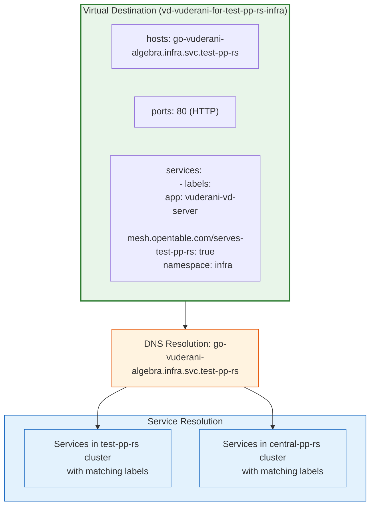

# Virtual Destination Configuration and DNS Resolution

This diagram illustrates how a Virtual Destination creates a DNS name and maps to services in different clusters.

The diagram shows:
- The configuration of a Virtual Destination with its hosts, ports, and service selectors
- How the Virtual Destination creates a DNS name that can be used by clients
- How the DNS name resolves to actual services in different clusters based on label matching 