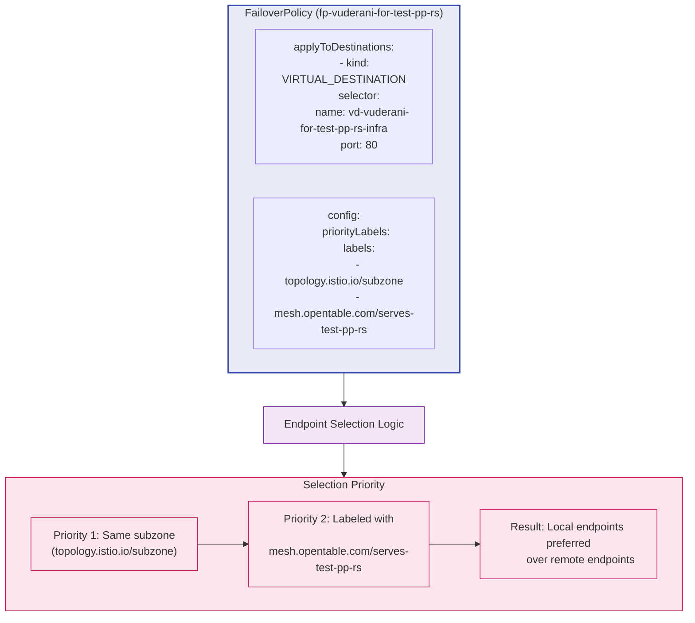

# FailoverPolicy Priority Labels and Selection Logic

This diagram illustrates how FailoverPolicy prioritizes endpoints and applies to Virtual Destinations.

The diagram shows:
- The configuration of a FailoverPolicy with its destination selectors and priority labels
- The priority order of labels used for endpoint selection
- How this priority order affects the selection of endpoints (local vs. remote) 