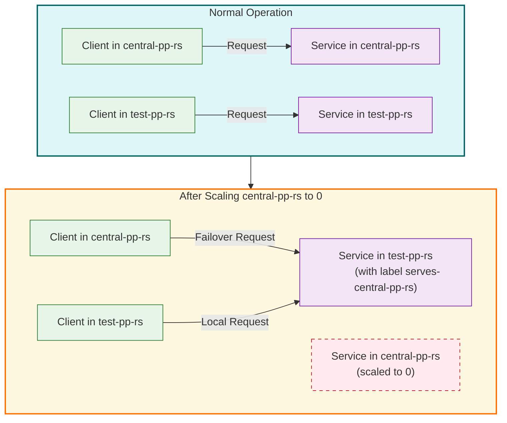

# Failover Scenario: Primary Cluster Failure

This diagram illustrates what happens during a failover scenario when the primary cluster is scaled to zero.

The diagram shows:
- Normal operation where clients in each cluster communicate with services in their own cluster
- What happens when the service in the central-pp-rs cluster is scaled to zero
- How the FailoverPolicy redirects traffic from the central-pp-rs cluster to the test-pp-rs cluster
- How the label `serves-central-pp-rs` enables the test-pp-rs service to handle requests for both clusters 