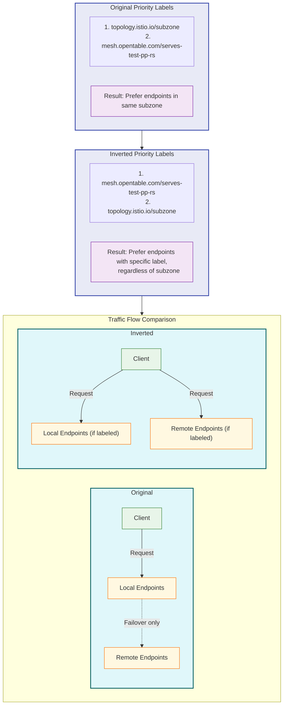

# Effect of Inverting Priority Labels

This diagram illustrates how inverting the priority labels in a FailoverPolicy affects traffic routing.

The diagram shows:
- The original priority label order that prefers endpoints in the same subzone
- The inverted priority label order that prefers endpoints with a specific label
- How traffic flows differently under each configuration:
  - Original: Local endpoints preferred, remote used only for failover
  - Inverted: Endpoints with the specific label preferred, regardless of location 